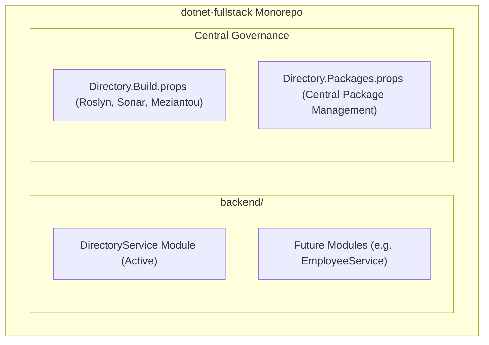

# Modular Monolith Architecture Overview

## 1. Architectural Philosophy

The codebase is structured as a **Modular Monolith** targeting **.NET 10** and **C# 13**. The system combines the operational simplicity of a single deployable unit with the strict domain boundaries and autonomy of microservices.



### Core Design Principles

1. **Modular Monolith Boundaries**:
   - Each business capability resides in its own isolated module under `backend/<ModuleName>/`.
   - Modules must not directly reference another module's internal implementation or database context. Cross-module communication is restricted to shared contracts or asynchronous integration events.
2. **Clean Architecture per Module**:
   - Every module is organized into concentric layers: **Domain**, **Contracts**, **Application**, **Infrastructure**, and **Presentation**.
   - The dependency rule is strictly inward: `Domain` has no dependencies on other layers; `Application` depends only on `Domain` and `Contracts`; `Infrastructure` and `Presentation` depend on `Application`.
3. **Vertical Slice CQRS**:
   - Features are organized as discrete vertical slices (`Command` + `Validator` + `Handler` or `Query` + `Handler`).
   - Slices use direct, strongly-typed interfaces (`ICommand`, `IQuery`, `ICommandHandler`, `IQueryHandler`) without MediatR overhead.
4. **Functional Result Pattern for Business Logic**:
   - Domain operations and use-case handlers return `Result<T, Error>` or `UnitResult<Error>` (via `CSharpFunctionalExtensions`) instead of throwing exceptions for control flow.
   - Exceptions are strictly reserved for unrecoverable infrastructure failures (e.g., database network partitions, process crashes).
5. **Uniform API Envelope**:
   - All HTTP responses are wrapped in an `Envelope<T>` contract containing `Result`, `Errors`, and `TimeGenerated`.
6. **Swappable Dual Persistence**:
   - Repositories provide both Entity Framework Core and Dapper implementations, selectable at runtime via configuration (`Repository:Implementation`: `EFCore` | `Dapper`).

---

## 2. Monorepo & Solution Structure

```
dotnet-fullstack/
├── .editorconfig                          # Code style and formatting rules
├── global.json                            # .NET SDK pin (10.0.203)
├── AGENTS.md                              # AI agent guidelines and doc navigation
├── CLAUDE.md                              # Reference redirect to AGENTS.md
├── llms.txt                               # Tier 2 AI entrypoint & invariant catalog
├── llms-full.txt                          # Tier 3 Consolidated full context
├── docs/                                  # Tier 1 Granular documentation
│   ├── index.md
│   ├── architecture/                      # Cross-cutting architecture blueprints
│   ├── development/                       # Development setup and testing guides
│   └── modules/                           # Bounded context documentation
│       └── directory-service/             # DirectoryService module docs
├── scripts/                               # Automation tooling (docs generators, etc.)
└── backend/
    ├── Directory.Build.props              # Monorepo-wide compiler and analyzer rules
    ├── Directory.Packages.props           # Central Package Management (CPM)
    └── DirectoryService/                  # DirectoryService Bounded Context
        ├── DirectoryService.slnx          # Solution file
        ├── src/
        │   ├── DirectoryService.Domain/
        │   ├── DirectoryService.Contracts/
        │   ├── DirectoryService.Application/
        │   ├── DirectoryService.Infrastructure.Postgres/
        │   └── DirectoryService.Presentation/
        └── tests/
            └── DirectoryService.Tests/
```

---

## 3. Layer Responsibilities within a Module

Each module adheres to this 5-project layer separation:

| Project Layer | Responsibility | Dependencies |
| :--- | :--- | :--- |
| **`<Module>.Domain`** | Enterprise business rules, aggregate roots, entities, domain events, domain error catalogs, and business invariants. | `CSharpFunctionalExtensions` only. No EF Core, no ASP.NET. |
| **`<Module>.Contracts`** | Public DTOs, external request/response definitions, and shared contract models. | Zero external dependencies. |
| **`<Module>.Application`** | Use-case orchestration, CQRS commands/queries, FluentValidation validators, repository interfaces, and domain coordination. | Depends on `.Domain` and `.Contracts`. |
| **`<Module>.Infrastructure.Postgres`** | Technical details: EF Core DbContext, Dapper SQL queries, migrations, connection management (`NpgsqlDataSource`), repository implementations. | Depends on `.Application` and `.Domain`. |
| **`<Module>.Presentation`** | HTTP endpoints, ASP.NET Core controllers, API Envelopes, Scalar OpenAPI documentation, and Serilog logging configuration. | Depends on `.Application`, `.Contracts`, and `.Infrastructure.Postgres`. |

---

## 4. Central Package & Quality Governance

The repository uses .NET Central Package Management (CPM) and strict code analysis:

- **`Directory.Packages.props`**: All package versions are centralized. Individual `.csproj` files use `<PackageReference Include="..." />` without specifying a `Version`.
- **`Directory.Build.props`**: Automatically injects Roslyn and third-party code analyzers into every project:
  - `Roslynator.Analyzers`: Refactoring, styling, and common .NET idioms.
  - `Meziantou.Analyzer`: Safety, performance, and best practices.
  - `AsyncFixer`: Detection of async/await anti-patterns.
  - `SonarAnalyzer.CSharp`: Deep security and bug detection.
  - `EnforceCodeStyleInBuild`: Enabled.
  - Target Framework: `net10.0`.
  - Nullable Reference Types: `enable`.
