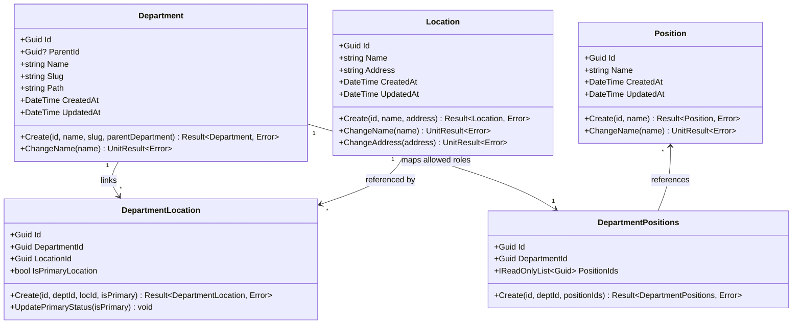

# DirectoryService: Domain Model & Business Rules

## 1. Domain Layer Overview

The **`DirectoryService.Domain`** layer encapsulates all enterprise business rules, entity models, domain invariants, and the error taxonomy.

### Invariant Design Rules
1. **Private Constructors**: Entities cannot be instantiated directly via `new`. Construction is gated behind static factory methods (e.g., `Department.Create(...)`).
2. **Encapsulated State**: All entity property setters are `private`. State mutations occur through explicit domain methods (e.g., `ChangeName(...)`).
3. **Pure C#**: The domain layer has zero references to ASP.NET, Entity Framework Core, or database drivers. The only external dependency is `CSharpFunctionalExtensions`.

---

## 2. Entities & Aggregates



### Department
- **Identifier**: `Guid Id`.
- **Properties**: `ParentId` (`Guid?`), `Name` (`string`), `Slug` (`string`), `Path` (`string`), `CreatedAt`, `UpdatedAt`.
- **Slug Invariant**: Must match regex `^[a-z0-9]+(?:-[a-z0-9]+)*$` (lowercase letters, numbers, and hyphens).
- **Materialized Path**:
  - Root department: `Path = Slug`.
  - Child department: `Path = Parent.Path + "/" + Slug`.
  - Example: Parent slug `engineering`, child slug `backend` → `engineering/backend`.
- **Factory Method**:
  ```csharp
  public static Result<Department, Error> Create(Guid id, string name, string slug, Department? parentDepartment)
  ```
- **Mutation**:
  ```csharp
  public UnitResult<Error> ChangeName(string name)
  ```

### Location
- **Identifier**: `Guid Id`.
- **Properties**: `Name` (`string`), `Address` (`string`), `CreatedAt`, `UpdatedAt`.
- **Invariants**: `Name` and `Address` must not be null or whitespace.
- **Factory Method**:
  ```csharp
  public static Result<Location, Error> Create(Guid id, string name, string address)
  ```
- **Mutations**: `ChangeName(string name)`, `ChangeAddress(string address)`.

### Position
- **Identifier**: `Guid Id`.
- **Properties**: `Name` (`string`), `CreatedAt`, `UpdatedAt`.
- **Factory Method**:
  ```csharp
  public static Result<Position, Error> Create(Guid id, string name)
  ```
- **Mutations**: `ChangeName(string name)`.

### Association Entities

#### DepartmentLocation
Links a department to an office facility:
- `DepartmentId` (`Guid`), `LocationId` (`Guid`), `IsPrimaryLocation` (`bool`).
- `Create(Guid id, Guid departmentId, Guid locationId, bool isPrimaryLocation = false)`.
- `UpdatePrimaryStatus(bool isPrimaryLocation)`.

#### DepartmentPositions
Defines allowed position IDs within a department:
- `DepartmentId` (`Guid`), `PositionIds` (`IReadOnlyList<Guid>`).
- `Create(Guid id, Guid departmentId, IReadOnlyList<Guid> positionIds)`.

---

## 3. Error Modeling & Taxonomy

All errors are modeled explicitly in `DirectoryService.Domain.Common`.

### Error Structure
```csharp
public record Error(string Code, string Message, ErrorType Type, string? InvalidField = null);
```

### ErrorType Enum
- `Validation`: Input failed syntax, format, or business invariant rules (maps to HTTP 400).
- `NotFound`: Requested entity was not found (maps to HTTP 404).
- `Conflict`: Unique constraint violation or state collision (maps to HTTP 409).
- `Forbidden`: Operation not permitted (maps to HTTP 403).
- `Unauthorized`: Authentication required (maps to HTTP 401).
- `Failure`: Unexpected or internal infrastructure error (maps to HTTP 500).

### Error Catalog (`Errors.cs`)
Standardized factory methods prevent string drift:

| Category | Method | Code | Default Message |
| :--- | :--- | :--- | :--- |
| **General** | `Errors.General.ValueIsRequired(fieldName)` | `value.is.required` | `Value is required.` |
| **General** | `Errors.General.ValueIsInvalid(fieldName)` | `value.is.invalid` | `Value is invalid.` |
| **General** | `Errors.General.NotFound(id, name)` | `record.not.found` | `Record with id '{id}' was not found.` |
| **General** | `Errors.General.Database(message)` | `database.error` | `A database error occurred.` |
| **General** | `Errors.General.Failure(message)` | `internal.server.error` | `An unexpected error occurred.` |
| **Department** | `Errors.Department.NotFound(id)` | `department.not.found` | `Department with id '{id}' was not found.` |
| **Department** | `Errors.Department.AlreadyExists(name)` | `department.already.exists` | `Department with name '{name}' already exists.` |
| **Department** | `Errors.Department.ParentNotFound(parentId)` | `department.parent.not.found` | `Parent department with id '{id}' was not found.` |
| **Department** | `Errors.Department.LocationAlreadyLinked` | `department.location.already.linked` | `Location '{locId}' is already linked...` |
| **Department** | `Errors.Department.LocationNotLinked` | `department.location.not.linked` | `Location '{locId}' is not linked...` |
| **Location** | `Errors.Location.NotFound(id)` | `location.not.found` | `Location with id '{id}' was not found.` |
| **Location** | `Errors.Location.AlreadyExists(name)` | `location.already.exists` | `Location with name '{name}' already exists.` |
| **Position** | `Errors.Position.NotFound(id)` | `position.not.found` | `Position with id '{id}' was not found.` |
| **Position** | `Errors.Position.AlreadyExists(name)` | `position.already.exists` | `Position with name '{name}' already exists.` |

### Result Pattern Integration
Methods return `Result<T, Error>` or `UnitResult<Error>`:
```csharp
// Example: Converting single Error to ErrorList
var errorList = Errors.Department.NotFound(id).ToErrorList();
return Result.Failure<DepartmentDto, ErrorList>(errorList);
```
