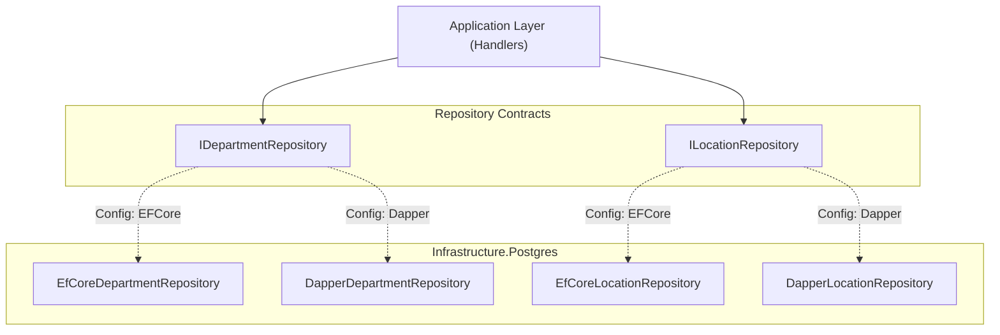

# DirectoryService: Persistence & Infrastructure

## 1. Infrastructure Overview

The **`DirectoryService.Infrastructure.Postgres`** project implements database storage and retrieval using PostgreSQL. It is engineered with a **Dual Repository Pattern**, allowing runtime switching between **Entity Framework Core** and **Dapper**.

---

## 2. Connection Architecture & Pooling

Database connections are optimized for performance and resource utilization via **`NpgsqlDataSource`**:

```csharp
// Registered in Presentation/DependencyInjection.cs
services.AddSingleton<NpgsqlDataSource>(_ => NpgsqlDataSource.Create(connectionString));

// EF Core DbContext uses the singleton data source
services.AddDbContext<AppDbContext>((sp, options) =>
    options.UseNpgsql(sp.GetRequiredService<NpgsqlDataSource>()));

// Dapper uses scoped connections created from the singleton data source
services.AddScoped<IDbConnection>(sp =>
    sp.GetRequiredService<NpgsqlDataSource>().CreateConnection());
```

### Key Architectural Benefits
- **Optimized Connection Pooling**: A single `NpgsqlDataSource` manages physical connection pools, preventing connection starvation and reducing handshake latency.
- **Non-Blocking Execution**: Both EF Core and Dapper open and close connections asynchronously using non-blocking connection management.
- **Cancellation Propagation**: All repository queries and commands accept and honor `CancellationToken`. If an HTTP request is aborted, queries are canceled immediately at the PostgreSQL server level without swallowing `OperationCanceledException`.

---

## 3. Dual Repository Pattern

Both persistence engines implement the exact same repository interfaces:
- `IDepartmentRepository` (in `DirectoryService.Application.Departments`)
- `ILocationRepository` (in `DirectoryService.Application.Locations`)



### Swapping Persistence Engines
The active repository is controlled by `appsettings.json`:
```json
{
  "Repository": {
    "Implementation": "EFCore" // Or "Dapper"
  }
}
```

Implementation selection logic in `DependencyInjection.cs`:
```csharp
if (repositoryImplementation.Equals("Dapper", StringComparison.OrdinalIgnoreCase))
{
    services.AddScoped<ILocationRepository, DapperLocationRepository>();
    services.AddScoped<IDepartmentRepository, DapperDepartmentRepository>();
}
else
{
    services.AddScoped<ILocationRepository, EfCoreLocationRepository>();
    services.AddScoped<IDepartmentRepository, EfCoreDepartmentRepository>();
}
```

---

## 4. Database Schema & Constraints

PostgreSQL table configurations reside in `DirectoryService.Infrastructure.Postgres.Configurations`.

### Tables & Key Columns

| Table | Entity | Key Columns & Types | Constraints & Indexes |
| :--- | :--- | :--- | :--- |
| **`departments`** | `Department` | `id` (UUID PK), `parent_id` (UUID FK nullable), `name` (VARCHAR 100), `slug` (VARCHAR 100), `path` (VARCHAR 500), `created_at` (TIMESTAMPTZ), `updated_at` (TIMESTAMPTZ) | UNIQUE index on `name`; UNIQUE index on `slug`; Index on `path` |
| **`locations`** | `Location` | `id` (UUID PK), `name` (VARCHAR 100), `address` (VARCHAR 250), `created_at` (TIMESTAMPTZ), `updated_at` (TIMESTAMPTZ) | UNIQUE index on `name` |
| **`department_locations`** | `DepartmentLocation` | `id` (UUID PK), `department_id` (UUID FK), `location_id` (UUID FK), `is_primary_location` (BOOLEAN) | Composite UNIQUE on `(department_id, location_id)`; Partial UNIQUE index on `(department_id)` WHERE `is_primary_location = true` |
| **`department_positions`** | `DepartmentPositions` | `id` (UUID PK), `department_id` (UUID FK), `position_ids` (UUID[]) | Foreign key to `departments` |
| **`positions`** | `Position` | `id` (UUID PK), `name` (VARCHAR 100), `created_at` (TIMESTAMPTZ), `updated_at` (TIMESTAMPTZ) | UNIQUE index on `name` |

---

## 5. Migrations Workflow

Migrations are generated using Entity Framework Core tools and stored in `Migrations/`:
```powershell
dotnet ef migrations add <Name> `
  --project backend/DirectoryService/src/DirectoryService.Infrastructure.Postgres `
  --startup-project backend/DirectoryService/src/DirectoryService.Presentation `
  --output-dir Migrations
```
